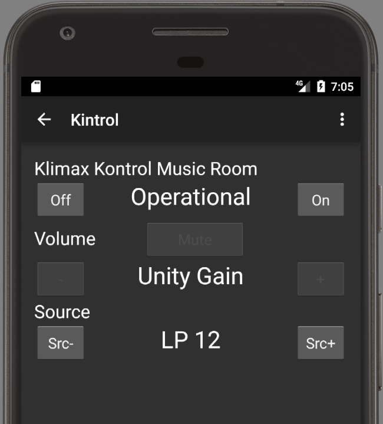

# Kintrol

Remote control app for [LINN&reg;](http://www.linn.co.uk/) KINOS&trade;, KISTO&trade; and Klimax Kontrol&trade; system controllers.

Copyright &copy; 2015-2017 Oliver Götz

This program is free software: you can redistribute it and/or modify
it under the terms of the [GNU General Public License version 3](http://www.gnu.org/licenses/gpl.html).

This program is distributed in the hope that it will be useful,
but WITHOUT ANY WARRANTY; without even the implied warranty of
MERCHANTABILITY or FITNESS FOR A PARTICULAR PURPOSE.  See the
GNU General Public License for more details.

You should have received a copy of the GNU General Public License
along with this program.  If not, see <http://www.gnu.org/licenses/>.

## Features

 - Support for multiple devices
 - Configurable display name for each device
 - Configurable IP address and port for each device
 - Configurable discrete Volume Value (optional) for each device
 - On/Off and display of Standby status
 - Source selection (-/+) and source name display
 - Volume -/+ and Mute with display of current volume setting
 
### Kinos and Kisto System Controllers

 - Surround Mode selection (-/+) and display of current setting
 - Display of total operation time and software versions in the device info display
      
### Klimax Kontrol Pre-Amplifier

 - Unity Gain detection: in case an input is configured with Unity Gain, the volume 
   and mute control buttons are disabled. 
 - Display of power on time, software and hardware version in the device info display
   Downloads

## Getting Started

### Connecting your Linn device to the network

Your KINO/KISTO/Klimax Kontrol needs to be connected to your network, and a fixed IP address must 
be configured for it.

You need to find a free network address within your network. You should be able to do that in the
configuration menu of your router. If possible, configure the router to not assign that network
address randomly. Depending on the router it might allow you to assign fixed addresses to 
specific devices, or define a range of addresses it will not assign dynamically to new devices
using DHCP.

#### Kinos and Kisto

  1. **Connect the Kinos or Kisto to your network**
  
     Plug in the network cable to the socket marked with "Ethernet" on the back of the device.
     
  2. **Set the network address**
  
     In the setup menu of the Kinos or Kisto, set the network address to the free fixed network
     address you selected.

#### Klimax Kontrol

Unlike Kinos or Kisto, the Klimax Kontrol does not come with an Ethernet socket. To make this 
work, you need a few things:

##### Prerequisites

  - An **RS232-to-ethernet-converter** (we have tested it with the 
    [USR-TCP232-302 from USR IOT](http://www.usriot.com/p/rs232-to-ethernet-converters/),
    but I'm sure there are lots of other models out there which work just as well

  - A **Software Upload Cable** or **Host to Product Cable**, as 
    [specified by Linn](http://docs.linn.co.uk/wiki/images/1/13/RS232_Cables_v102.pdf),
    either of these two should work.
    
  - A [**null modem adapter**](https://en.wikipedia.org/wiki/Null_modem).
    If you are soldering the cable yourself and you feel up to it, you can of course try and
    modify the cable layout to include the null modem wiring, so that you don't need an 
    additional null modem adapter.

##### Hardware Setup

  1. Connect the Software Upload Cable or Host to Product Cable to **RS232 IN** socket of the 
     Linn Klimax Kontrol
     
  2. Connect the null modem adapter to the 9-pin D-Sub plug of the Linn cable
  
  3. Connect the RS232-to-ethernet-converter to the null modem adapter
  
  4. Connect the RS232-to-ethernet-converter to your network
  
##### Software Setup

  1. Install the setup software for the RS232-to-ethernet-converter on your computer
  
  2. Configure the RS232-to-ethernet-converter:
  
     - **Local IP Config:** use static IP and configure the static IP you have selected 
       for your Linn device. Submask is usually 255.255.255.0 for private networks, and 
       Gateway is the IP address of your network router.
       
     - **Serial Port:** Baud rate: 9600, Data Size: 7 bit, Parity: even, Stop Bits: 1 bit,
       Local Port: 9004, Remote Port: 9004, Work Mode: TCP Server:
       
       
       RS232-converter-settings
       
Now, the network commands sent by the app to the RS232-to-network-converter should be forwarded
to the RS232 port of the Klimax Kontrol device.

### Installing the app

  1. **Allow Unknown Sources**

     Because the Kintrol app is not available from the Google Play store, in order to install
     it, you need to allow installation from unknown sources. To do that, go to the settings
     menu of your android device, and in the *Security* section, tick the *Unknown Sources*
     option.
     
  2. **Download the app**

     In the web browser of your android device, follow the link 
     https://github.com/Geekgasm/kintrol/releases/download/0.25/kintrol-v0.25.apk
     to download tha latest version 0.25 of the Kintrol app.
     
  3. **Install the app**
     
     Depending on your android version, you might now be prompted to install the downloaded
     app. If not, swipe down from the notification bar at the top of the screen. Your dowloaded
     app should be listed. Tap on it.
     
     Follow the on-screen instructions to install the app.
     
  4. **Disallow Unknown Sources**
  
     For security reasons, you should revert step 1 and disallow installation from unknown sources
     again to prevent you from accidentally install something.

### Starting the app for the first time

When you start the app for the first time, it does not know about your Linn device.
It will prompt you to enter the configuration for your Linn Kinos, Kisto or Klimax Kontrol:

Enter the required information:

 - The device type: select either *Kinos*, *Kisto*, or *Klimax Kontrol*
 - A name for the device (you can pick that freely)
 - The IP address for your device. 
 
 Optionally, you can enter:
 
  - The port: this defaults to 9004 if you don't specify anything here. Leave it empty
    for Kinos and Kisto. For Klimax Kontrol, enter the port number you configured for
    your Network to RS232 adapter if it differs from 9004.
  - A discrete volume value. If you specify a volume here, an additional button 
    will appear on the device control screen, allowing you to quickly set the 
    volume to this value.

After you filled in the required values, press on the *OK* button and see the 
entry screen with one device listed.

## Using the App

### The Device Chooser Screen

The app allows you to configure multiple Linn devices. 
When the app is started, it shows the *Device Chooser Screen*, whose primary 
function is to select the device you want to control. You will see the list of devices,
which you have configured:

To start controlling a device, simply tap on the device name in the list. This will 
bring you to the *Device Control Screen* (see next section).

To add more devices, open the application menu (the three small dots in the upper right corner):

***Add Device*** lets you add a new device to the list. The configuration menu is the same as for 
the first device (see section *Starting the app for the first time*).

***About Kintrol*** will open the screen with the app information (copyright notice,
license information and links to this Github project):
 

### The Device Control Screen

If your device is switched on an reachable via network the device control screen allows you to
control the most commonly used functions for daily operations. The available controls are different
depending on the device type. The picture on the left shows a normal device control screen for
a Kino or Kisto device, the picture on the right for a Klimax Kontrol:

 

The displays for standby status, volume and mute status, selected input and surround mode will 
always show the values as received by the Linn device, so there might be a slight lag between 
pressing a button on the app and seeing the result displayed in the app.

The controls are grouped into several sections:

#### Device Status:

The caption for this group is the name of your device. The ***On*** button switches the 
device on, the ***Off*** button puts it in standby more. 

The display will show one of these three values:

  - *Standby* if the app is connected to the device and the device is in standby mode
  - *Operational* if the app is connected to the device and the device is switched on
  - *Not Connected* if the app is not connected to the device. In this case, check if the
      device is powered on (via the main power switch on the back), and if the configured
      IP address and port match the settings in the device.
      
#### Volume:

The minus (*-*) and plus (*+*) buttons decrease or increase the volume level
by one; you can also use the volume hard-buttons for this. 

The *Mute* button mutes or unmutes the device. 

In case you have configured a 
discrete volume level, an additional button is shown next to the mute button showing
the configured discrete volume button. Pressing it will set this volume directly on the 
device.

The display will show one of these three values:

  - The current volume level (in case the device is not muted)
  - *Muted* in case the device is muted
  - *Unity Gain* (**Klimax Kontrol only!**) In case unity gain is configured for the current input. In that case, the 
    input signal is directly passed through to the outputs and the volume cannot be changed
    on the Klimax Kontrol device. The volume control buttons are disabled in case unity gain is
    set:

    

#### Source:

The *Src-* and *Src+* buttons let you cycle through the sources configured in
the device. 

The display will show the name you configured for the sources. 

  - Please note, that for Kinos and Kisto devices, the user-defined input profiles are 
      selected with the *Source* buttons. These input profiles need to be set up in the 
      configuration menu of the Kinos or Kisto and can combine audio and video inputs.
      The app does not have buttons for separately selecting audio and video inputs.
  - For Klimax Kontrol devices, the source buttons control the audio input.
    
#### Surround Mode (Kinos and Kisto only!): 

The minus (*-*) and plus (*+*) buttons let you cycle through the available surround modes 
for the current input. 

The display will show the name of the surround mode.

#### App Menu:

Opening the app menu from the device control screen allows you to access thes features:
 
  - *Edit device:* change the settings of the device. 
  - *Delete device:* from the device list. You will be prompted if you really want to do that. 
    It cannot be undone! After deleting the device, the app will send you back to the 
    Device Chooser screen.
  - *Show Device Info:* displays the device information. The exact set of information depends 
    on the device type.
    
    

  - *About Kintol:* displays the same information screen already described in the Device Chooser
    section.

## Used Libraries

The following open source libraries are included in this app:

 - [Apache Commons Net](https://commons.apache.org/proper/commons-net/) for the telnet libraries
 - [google-gson](https://code.google.com/p/google-gson/) for JSON handling
 - [AutoFitTextView](https://github.com/AndroidDeveloperLB/AutoFitTextView) for gracefully fitting the status texts into the available space

All three libraries are licenses under the [Apache License 2.0](http://www.apache.org/licenses/LICENSE-2.0), which is included in the respective libraries folders of this project.

UI resources for Holo theme created with [Android Holo Colors Generator](http://android-holo-colors.com/) by [Jérôme Van Der Linden](mailto:jeromevdl@android-holo-colors.com). All generated art is licensed under a [Creative Commons Attribution 3.0 Unported License](http://creativecommons.org/licenses/by/3.0/).

## References

The specifications for the control protocol for [KINOS](http://docs.linn.co.uk/wiki/images/3/3f/Kinos_RS232_Spec_v0101.pdf),
[KISTO](http://docs.linn.co.uk/wiki/images/4/4f/Kisto_rs232_commands_v106.pdf) and 
[Klimax Kontrol](http://docs.linn.co.uk/wiki/images/3/36/Kli_Kontrol_RS232_Commands.pdf) 
can be found at the [LINNDOCS web site](http://docs.linn.co.uk/wiki/index.php/RS232).

## Acknowledgements

 - App icon by Mr. Truesound
 - Many thanks to the LINN customer support

## Questions and Anwsers

**Is the app collecting any of my data?** 
Absolutely not! The only data the app is sending out are the control codes needed to 
talk to the Linn device, and it only uses the IP address you configure for that device.
There is no data collected and no data sent to any outside party.

**Why is the app not on the Google Play store?**
Registering for the Google Play store as a developer comes with a fee. Since this is the only 
app I developed so far, it didn't seem worth it for me. Maybe this will change in the future,
but there are currently no such plans.

**Why are there no automated tests?**
Shame on me! Normally, I am a big proponent of automated tests and test-driven development. 
However, since this was my first go at an Android app there was a lot of trial and error 
involved for me. Add to that a logic which relies heavily on network communication with a 
device for which I had to figure out some of the behaviour on the go, I saw it as too 
restrictive to add a test double only to find out later that the behavior of the real 
device is different anyhow.

**Why can I add more than one device? Who would ever need that?**
I do! ;-) We have one Kinos and one Klimax Kontrol devices in the house and since I primarily 
wrote the app for ourselves, this is how it turned out. If I find the time and motivation I 
might change the UI in the future to only have the device control screen and have a selection 
possibility for several devices embedded there.

**Is there an iOS version?**
No. The reasons I opted for Android are that I am a Java developer by trade and therefore I 
found it more convenient to not have to learn a new language at the same time as learning the 
SDK and figure out the behavior of the Linn devices. Also, for Android I am not necessarily 
forced to go through the official release process to get the app on my device and out into 
the world. There are no plans currently to port this to iOS. But feel free to start such a 
project yourself.

## Contact Information

Please send general feedback, questions, suggestions to mailto:developer@geekgasm.eu

To report bugs, please create a [new issue in the Github project](https://github.com/Geekgasm/kintrol/issues)

